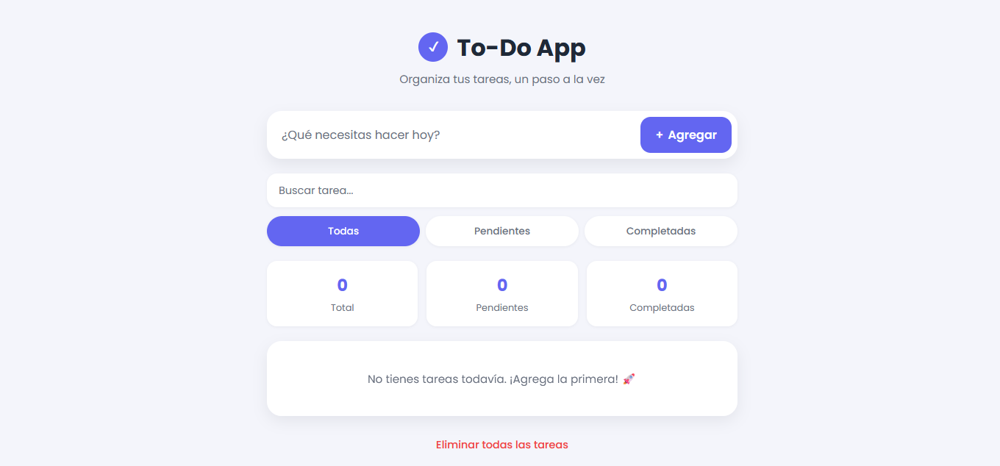
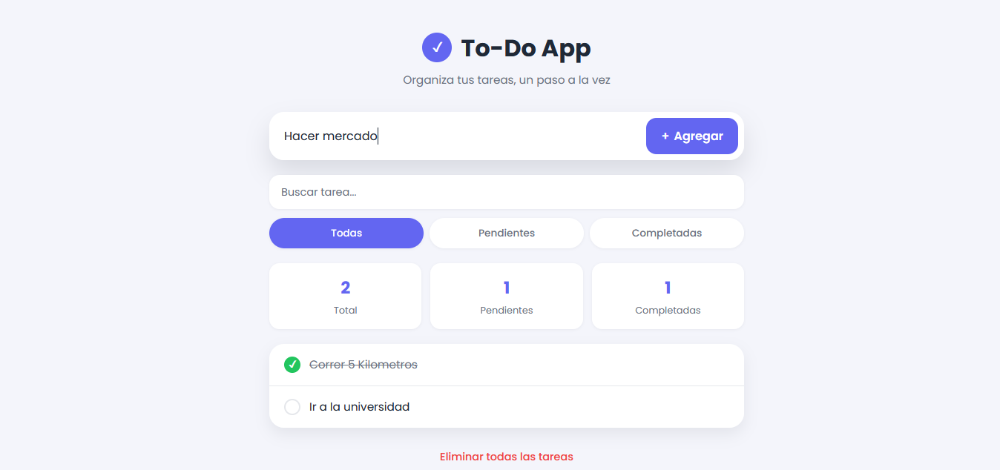

# ✅ To-Do App

Una aplicación de lista de tareas moderna, responsive y construida enteramente con **JavaScript Vanilla** — sin frameworks ni librerías externas. Proyecto de portafolio como estudiante de Ingeniería de Sistemas.


---

## 📖 Descripción

**To-Do App** es una aplicación de gestión de tareas que permite crear, editar, completar, buscar y filtrar pendientes, con persistencia de datos en el navegador. Fue desarrollada como ejercicio práctico para reforzar fundamentos de **HTML semántico**, **CSS moderno (Grid, Flexbox, animaciones)** y **JavaScript ES6**, sin depender de frameworks.

El objetivo no fue solo construir una app funcional, sino escribir código limpio, organizado y bien comentado — pensado para ser leído y entendido, no solo ejecutado.

---

## ✨ Características

- ➕ Agregar tareas nuevas
- ✏️ Editar tareas en línea (sin ventanas emergentes)
- ✅ Marcar / desmarcar tareas como completadas
- 🗑️ Eliminar tareas individuales, con animación de salida
- 🧹 Eliminar todas las tareas (con confirmación)
- 🔍 Búsqueda de tareas en tiempo real
- 🧭 Filtros: Todas / Pendientes / Completadas
- 📊 Contadores dinámicos (total, pendientes, completadas)
- 💾 Persistencia automática con `localStorage`
- 📱 Diseño 100% responsive (móvil, tablet, escritorio)
- 🎨 Animaciones suaves en checkboxes, entradas y salidas de tareas
- 💬 Mensajes amigables para estados vacíos y errores de validación

---

## 🛠️ Tecnologías

| Tecnología | Uso |
|---|---|
| **HTML5** | Estructura semántica (`header`, `main`, `section`, `article`, `footer`) |
| **CSS3** | Variables CSS, Flexbox, Grid, animaciones `@keyframes`, media queries |
| **JavaScript (ES6+)** | Manipulación del DOM, delegación de eventos, `localStorage`, closures |

No se utilizaron frameworks, librerías ni CSS de terceros (excepto la tipografía "Poppins" de Google Fonts).

---


## 📸 Capturas

<p align="center">
  
</p>

<p align="center">
  
</p>

---

---

## 🚀 Instalación

Este proyecto no requiere instalación de dependencias ni build tools.

```bash
# 1. Clona el repositorio
git clone https://github.com/BreinerR/todo-app.git

# 2. Entra a la carpeta del proyecto
cd todo-app

# 3. Abre index.html en tu navegador
# (o usa la extensión "Live Server" de VS Code para recarga automática)
```

---

## 🧑‍💻 Uso

1. Escribe una tarea en el campo de texto y presiona **Agregar** (o `Enter`).
2. Haz clic en el círculo de una tarea para marcarla como completada.
3. Pasa el mouse sobre una tarea para ver los botones de **editar** (✎) y **eliminar** (🗑).
4. Usa el buscador para filtrar tareas por texto, y los botones **Todas / Pendientes / Completadas** para filtrar por estado.
5. Tus tareas se guardan automáticamente: puedes cerrar la pestaña y volverán a aparecer al abrir la app de nuevo.

---

## 📚 Aprendizajes

Este proyecto fue una oportunidad para practicar, de forma deliberada:

- Separar la aplicación en **estado** (`tasks`) y **una función de render** (`renderTasks`) que siempre refleja ese estado — el mismo principio detrás de frameworks como React.
- **Delegación de eventos**, para manejar clics en elementos que se crean y destruyen dinámicamente.
- Sincronizar **animaciones CSS con lógica JavaScript** (por ejemplo, esperar el evento `animationend` antes de eliminar un elemento del DOM).
- Diseñar con **variables CSS (design tokens)** para mantener consistencia visual y facilitar cambios futuros.
- Persistir datos del lado del cliente con `localStorage`, incluyendo manejo de errores al leer datos corruptos.
- Pensar en **UX real**: mensajes amigables, confirmaciones antes de acciones destructivas, y accesibilidad básica (`aria-label`, foco, comportamiento en pantallas táctiles).

---

## 📁 Estructura del proyecto

```
todo-app/
│
├── assets/
│   ├── css/
│   │   └── style.css
│   ├── js/
│   │   └── script.js
│   └── img/
│
├── index.html
├── README.md
├── LICENSE
└── .gitignore
```

---

## 🌐 Demo

🔗 [Ver demo en GitHub Pages](https://github.com/BreinerR/todo-app.git) _
---

## 📌 Estado del proyecto

**Terminado** ✅ — Todas las funcionalidades planeadas están implementadas y probadas. Posibles mejoras futuras: drag & drop para reordenar tareas, categorías/etiquetas, modo oscuro, exportar/importar tareas en JSON.

---

## 👤 Autor

**Breiner Renteria**
Estudiante de Ingeniería de Sistemas

- GitHub: [@tu-usuario](https://github.com/BreinerR)


---

## 📄 Licencia

Este proyecto está bajo la licencia [MIT](./LICENSE). Puedes usarlo, modificarlo y distribuirlo libremente, dando el crédito correspondiente.